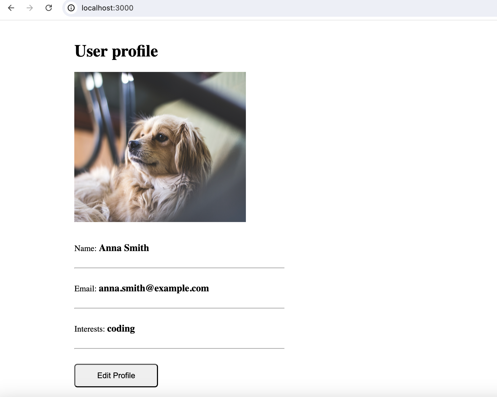
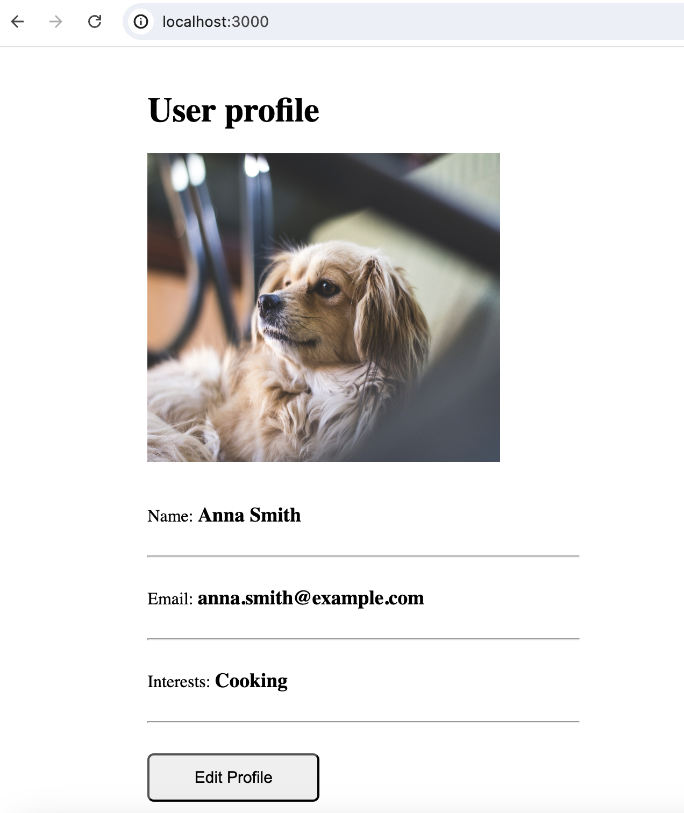
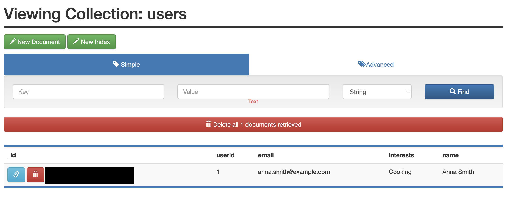

# Developing with Docker: User Profile Web App

This demo app shows a simple user profile app set up using 
- index.html with pure js and css styles
- nodejs backend with express module
- mongodb for data storage

All components are docker-based

## About the Project 📓
This project is a simple web application designed to practice using Docker. It features a Node.js backend with Express, MongoDB for data storage, and a frontend built with HTML, JavaScript, and CSS. The application allows users to create profiles and save them to the back end mongo-db. The project is containerized using Docker, enabling easy deployment and scalability - important in the world of DevOps!!

## Instructions 👓

### With Docker

#### To start the application

Step 1: Create docker network

    docker network create mongo-network 

Step 2: start mongodb 

    docker run -d -p 27017:27017 -e MONGO_INITDB_ROOT_USERNAME=admin -e MONGO_INITDB_ROOT_PASSWORD=password --name mongodb --net mongo-network mongo    

Step 3: start mongo-express
    
    docker run -d -p 8081:8081 -e ME_CONFIG_MONGODB_ADMINUSERNAME=admin -e ME_CONFIG_MONGODB_ADMINPASSWORD=password --net mongo-network --name mongo-express -e ME_CONFIG_MONGODB_SERVER=mongodb mongo-express   

_NOTE: creating docker-network in optional. You can start both containers in a default network. In this case, just emit `--net` flag in `docker run` command_

Step 4: open mongo-express from browser

    http://localhost:8081

Step 5: create `user-account` _db_ and `users` _collection_ in mongo-express

Step 6: Start your nodejs application locally - go to `app` directory of project 

    npm install 
    node server.js
    
Step 7: Access you nodejs application UI from browser

    http://localhost:3000

### With Docker Compose

#### To start the application

Step 1: start mongodb and mongo-express

    docker-compose -f docker-compose.yaml up
    
_You can access the mongo-express under localhost:8080 from your browser_
    
Step 2: in mongo-express UI - create a new database "my-db"

Step 3: in mongo-express UI - create a new collection "users" in the database "my-db"       
    
Step 4: start node server 

    npm install
    node server.js
    
Step 5: access the nodejs application from browser 

    http://localhost:3000

#### To build a docker image from the application

    docker build -t my-app:1.0 .       
    
The dot "." at the end of the command denotes location of the Dockerfile.

## Screenshots 📸
Here is a screenshot of the simple (but working!) web app:

Here is the updated user profile, proving the ability to edit and save:

Here is a screenshot of the mongo-db showing the changed record:

## Credit 👭

Thisi project was taken from the CodeFirstGirls DevOps MOOC. A brilliant UK-based community which aims to get more women into tech! Check out the current MOOCs [here](https://codefirstgirls.com/courses/moocs/)
